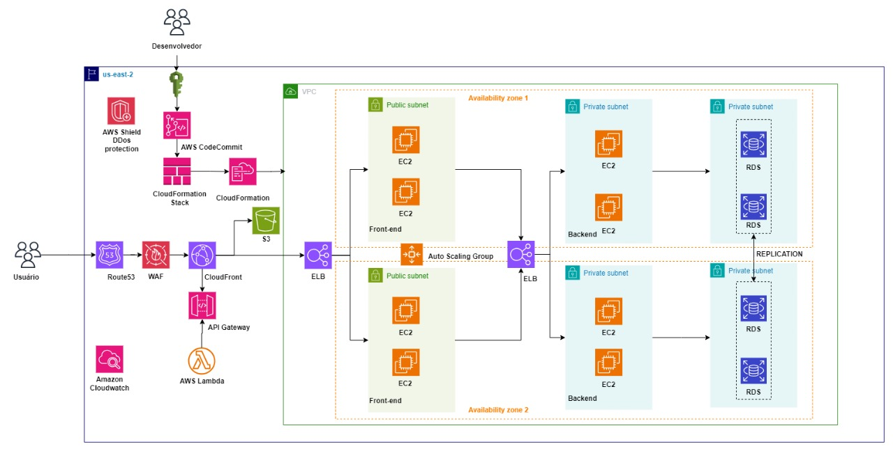

# Arquitetura de Infraestrutura Automatizada na AWS para E-commerce 🛒

Este repositório contém o projeto de uma arquitetura de infraestrutura na AWS para uma plataforma de e-commerce especializada em equipamentos esportivos. O design da infraestrutura foi baseado em uma abordagem de microserviços, visando automação, escalabilidade e controle de custos.

📌 Resumo do Projeto

Objetivo: Criar uma infraestrutura escalável e automatizada na AWS para suportar o crescimento do e-commerce, com segurança e alta disponibilidade.

Orçamento:

- Investimento inicial: $10.000

- Custo mensal estimado: $500

🔧 Serviços Utilizados

A InfraCloud Consultoria propos o uso das seguintes tecnologias AWS para automatizar e escalar a infraestrutura da Nova Tech:

1. Amazon EC2 (Elastic Compute Cloud): Provisionamento de instâncias de servidores com Auto Scaling para adaptar a infraestrutura ao volume de tráfego automaticamente.

2. AWS Lambda: Execução de código sob demanda sem necessidade de gerenciamento de servidores, ideal para operações baseadas em eventos, reduzindo custos.

3. Amazon API Gateway: Gerenciamento escalável e seguro de APIs REST, permitindo o roteamento entre o front-end e os microserviços.

4. Amazon RDS (Relational Database Service): Banco de dados MySQL com replicação multi-AZ, backups automáticos e alta disponibilidade.

5. Amazon S3: Armazenamento de objetos (como imagens de produtos) e backups de dados estáticos.

6. Amazon CloudFront: Distribuição global de conteúdo via CDN para reduzir latência.

7. Elastic Load Balancer (ELB): Balanceamento de carga entre as instâncias EC2 para garantir alta disponibilidade e distribuição eficiente do tráfego.

8. Amazon Route 53: Serviço de DNS escalável para gerenciamento de domínios e roteamento de tráfego de forma rápida e segura.

9. AWS WAF (Web Application Firewall): Proteção contra ataques como DDoS, SQL Injection e XSS, garantindo a segurança da aplicação.

10. AWS Shield: Proteção avançada contra ataques DDoS para proteger a aplicação e aumentar sua resiliência.

11. AWS IAM (Identity and Access Management): Controle de acessos com políticas de segurança para garantir que apenas usuários autorizados possam acessar os recursos da AWS.

12. Amazon CloudWatch: Monitoramento de métricas, logs e alarmes para assegurar a saúde da infraestrutura em tempo real.

13. AWS Budgets: Monitoramento do orçamento com alertas de custo para garantir que os gastos fiquem dentro dos limites planejados.

14. AWS CloudFormation: Automação da infraestrutura através de templates IaC (Infrastructure as Code), garantindo repetibilidade e consistência nas configurações.

15. AWS CodeCommit: Repositório Git seguro para controle de versões e colaboração no desenvolvimento do código.

⚙️ Detalhes da Arquitetura

A arquitetura foi projetada com foco em:
  Alta Disponibilidade: Redundância em múltiplas zonas de disponibilidade.
  Escalabilidade: Capacidade de aumentar ou reduzir automaticamente a quantidade de recursos.
  Automação: Uso do CloudFormation e Lambda para facilitar a gestão de recursos.
  Otimização de Custos: Estimativa de $500/mês para manter a operação

📝 Aprendizados

Este projeto foi uma excelente oportunidade para explorar as melhores práticas da AWS, especialmente para e-commerces. Aprendemos a otimizar custos e a projetar uma infraestrutura que possa crescer conforme a demanda do negócio.

Para mais detalhes, acesse o repositório e sinta-se à vontade para sugerir melhorias! 😄

captura de tela

